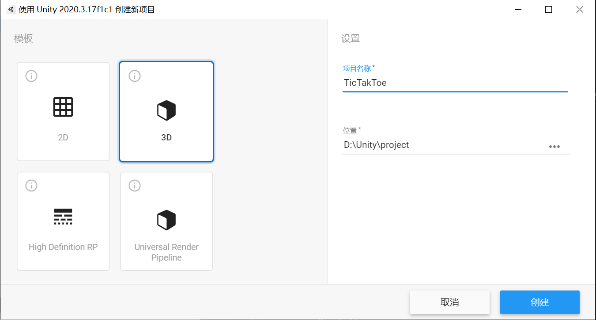
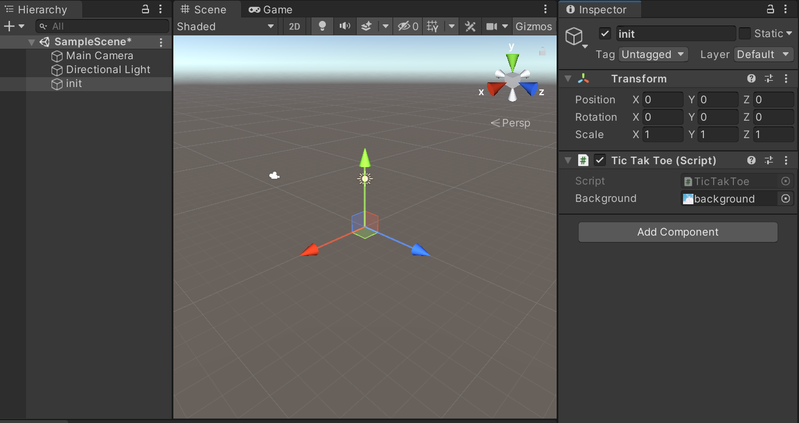
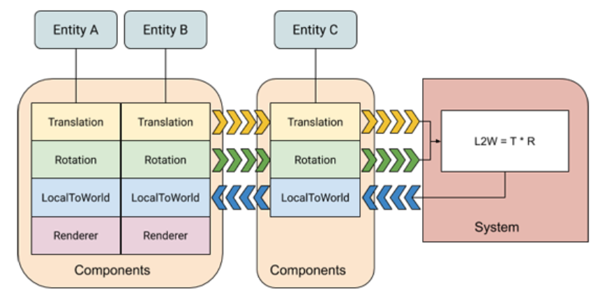
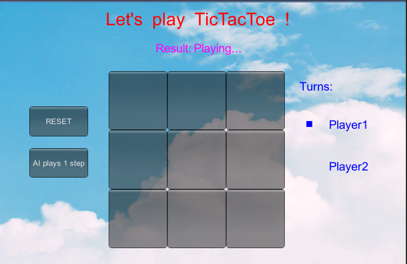
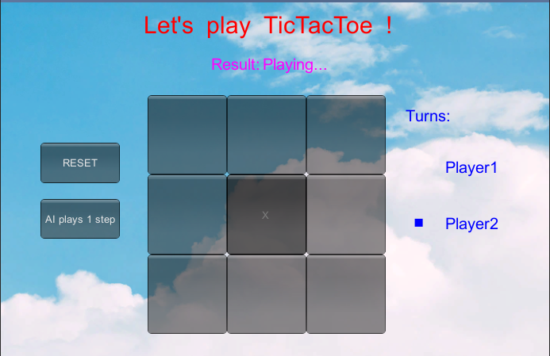
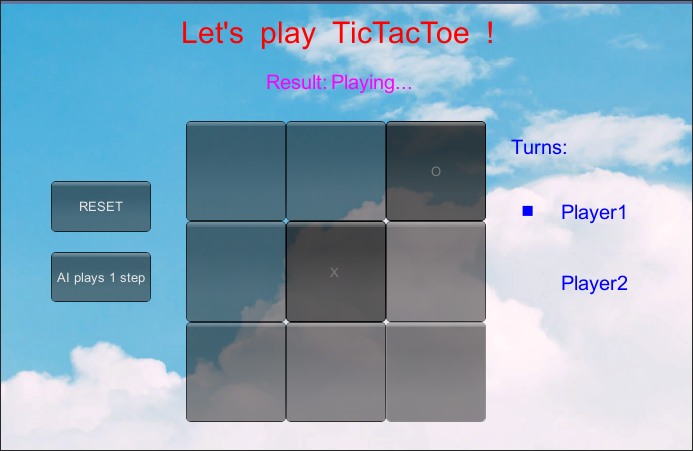
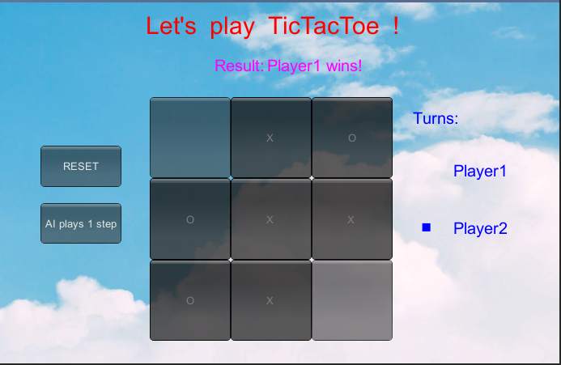
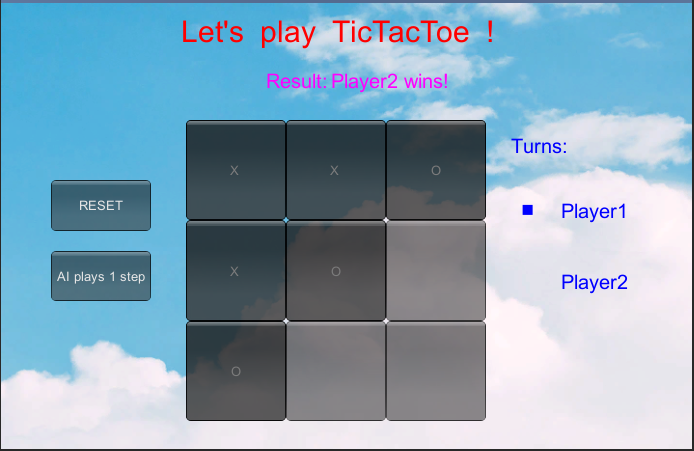
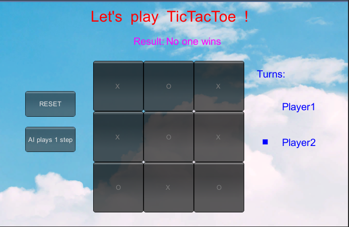

# 项目文档
## 项目配置
+ 首先新建项目

    
+ 点击上方工具栏`GameObject`，选择`Greate Empty`，并将空的游戏对象命名为init。
+ 将代码文件`TicTacToe.cs`（在code文件夹下）和背景图片`background.jpg`（在picture文件夹中）拖入Assets栏。
+ 将Assets栏的`TicTacToe.cs`拖到左侧init上，点击init，将Assets栏的`background.jpg`拖到右侧TicTakToe组件的Background属性上

    
+ 编译运行启动游戏
## 项目实现
### Unity官网对ECS的定义
+ The Entity Component System (ECS) is the core of the Unity Data-Oriented Tech Stack. As the name indicates, ECS has three principal parts:
    + Entities — the entities, or things, that populate your game or program
    + Components — the data associated with your entities, but organized by the data itself rather than by entity. (This difference in organization is one of the key differences between an object-oriented and a data-oriented design.)
    + Systems — the logic that transforms the component data from its current state to its next state— for example, a system might update the positions of all moving entities by their velocity times the time interval since the previous frame.

    
### 具体实现
+ 整体设计思路：按项目要求实现实体（数据），部件（逻辑），系统（交互与呈现）三者分离，实现游戏状态随与玩家的交互更新、游戏界面随游戏状态更新、轮次自动切换、AI自动落子、游戏结局的判定的功能。
+ 实体（数据）：数据结构如下
    ```
        private int turn = 1;    //1 - Player 1, 0 - Player 2 
        private int[,] board = new int[3,3];   //标记玩家落子
        private int result = 0;  //0代表未完成，1 - Player 1 wins，2 - Player 2 wins，3-平局
        //背景
        public Texture2D background;  
        //字体
        private GUIStyle fontStyle;
        private GUIStyle fontStyle2;
        private GUIStyle fontStyle3;
        private GUIStyle fontStyle4;  
    ```
+ 部件（逻辑）：
    + 游戏基础界面初始化
        ```
            void Init(){
                //标题字体设置
                fontStyle = new GUIStyle();  
                fontStyle.normal.background = null;   
                fontStyle.normal.textColor= new Color(1, 0, 0);    
                fontStyle.fontSize = 30;   

                //游戏状态字体设置
                fontStyle2 = new GUIStyle();  
                fontStyle2.normal.background = null;   
                fontStyle2.normal.textColor= new Color(1, 0, 1);    
                fontStyle2.fontSize = 20;   

                //player&turn字体设置
                fontStyle3 = new GUIStyle();  
                fontStyle3.normal.background = null;   
                fontStyle3.normal.textColor= new Color(0, 0, 1);    
                fontStyle3.fontSize = 20;   

                //dot字体设置
                fontStyle4 = new GUIStyle();  
                fontStyle4.normal.background = null;   
                fontStyle4.normal.textColor= new Color(0, 0, 1);    
                fontStyle4.fontSize = 100;   

                //背景图片设置
                GUI.Label (new Rect (0, 0, 1000,500), background);
                //显示标题、玩家轮次提示
                GUI.Label (new Rect (180, 15, 200, 100), "Let's  play  TicTacToe  !",fontStyle);  
                GUI.Label (new Rect (560, 200, 100, 50), "Player1",fontStyle3); 
                GUI.Label (new Rect (560, 270, 100, 50), "Player2",fontStyle3);
                GUI.Label (new Rect (510, 135, 100, 50), "Turns:", fontStyle3);  
            }
        ```
    + 重置棋盘
        ```
            void Reset() { 
                result = 0;
                turn = 1;    
                for (int i=0; i<3; ++i) {    
                    for (int j=0; j<3; ++j) {    
                        board[i,j] = 0;    
                    }    
                }  
            }   
        ```
    + 若游戏未结束，当玩家点击棋盘上未落子位置时添加标记，记录下棋者
        ```
            void mark(int i,int j){
                if (result == 0 && board [i, j] == 0) {    
                    if (turn == 1)    
                        board [i, j] = 1;  
                    else    
                        board [i, j] = 2;    
                    turn = 1-turn;    
                }  
            }
        ```
    + 随机下一步棋：先随机选取一个棋盘上的位置，然后从该位置开始从左往右、从上往下依次扫描棋盘上的9个位置，直到找到一个空位置或全部位置扫描完为止，若找到空位则标记下棋者并交换轮次
        ```
            void AiPlay(){
                //随机选取一个棋盘上的位置
                int i = (int)Random.Range (0, 2);
                int j = (int)Random.Range (0, 2);
                int cnt = 0;
                //从该位置开始从左往右、从上往下依次扫描棋盘上的9个位置，直到找到一个空位置或全部位置扫描完为止
                while (board [i, j] != 0) {
                    i++;
                    j=(j + i / 3)%3;
                    i%=3;
                    cnt++;
                    if (cnt == 9)
                        break;
                }
                //检测是否找到空位置
                int flag = 0;
                if (board [i, j] == 0)
                    flag = 1;
                else return ;
                //若找到空位则标记下棋者
                if (turn == 1 && flag == 1)    
                    board [i, j] = 1;  
                else if(turn == 0 && flag == 1)   
                    board [i, j] = 2;    
                //交换轮次
                if (flag == 1)
                    turn = 1-turn;    
            }
        ```
    + 检查游戏是否结束，返回游戏状态：0代表未完成，1代表Player 1 获胜，2代表Player 2 获胜，3代表平局
        ```
            int check() {    
                //检查是否存在一行下满三颗同种棋
                for (int i=0; i<3; ++i) {    
                    if (board[i,0]!=0 && board[i,0]==board[i,1] && board[i,1]==board[i,2]) {    
                        return board[i,0];    
                    }    
                }    
                //检查是否存在一列下满三颗同种棋
                for (int j=0; j<3; ++j) {    
                    if (board[0,j]!=0 && board[0,j]==board[1,j] && board[1,j]==board[2,j]) {    
                        return board[0,j];    
                    }    
                }    
                //检查是否存在一条对角线下满三颗同种棋
                if (board[1,1]!=0 && board[0,0]==board[1,1] && board[1,1]==board[2,2] || board[0,2]==board[1,1] && board[1,1]==board[2,0]) {    
                    return board[1,1];    
                }    
                //检查棋盘是否下满
                int count = 0;
                for (int i = 0; i < 3; i++) {
                    for (int j = 0; j < 3; j++) {
                        if (board [i, j] != 0)
                            count++;
                    }
                }
                //若棋盘下满且无人获胜则平局
                if (count == 9)
                    return 3;
                //若棋盘未下满且无人获胜则游戏继续
                return 0;    
            }   
        ```
+ 系统（交互与呈现）：
    + OnGUI每帧刷新，每次调用`Init`、`ShowTurn`、`ShowBoard`、`ShowResult`四个辅助函数保证游戏界面随游戏状态而更新，若用户点击`RESET`按钮，则调用`Reset`函数重置游戏，若用户点击`AI plays 1 step`按钮，则调用`AiPlay`函数使计算机随机落一子
        ```
            void OnGUI() {   
                //游戏基础界面初始化
                Init();
                //显示轮次
                ShowTurn();
                //设置重置游戏按钮
                if (GUI.Button (new Rect (50, 180, 100, 50), "RESET"))  
                    Reset ();  
                //显示棋盘状态
                ShowBoard();
                //显示游戏状态
                ShowResult();
                //AI plays 1 step
                if (GUI.Button (new Rect (50, 250, 100, 50), "AI plays 1 step") && result == 0) {
                    AiPlay();
                }
            }  
        ```
    + 显示轮次
        ```
            void ShowTurn(){
                if (turn == 1) {
                    GUI.Label (new Rect (510, 155, 50, 50), "·", fontStyle4);
                } else {
                    GUI.Label (new Rect (510, 225, 50, 50), "·", fontStyle4);
                }
            }
        ```
    + 根据标记显示棋子，当玩家点击棋盘时调用`mark`函数更新棋盘状态
        ```
            void ShowBoard(){
                for (int i=0; i<3; ++i) {    
                    for (int j=0; j<3; ++j) {    
                        if (board [i, j] == 1)    
                            GUI.Button (new Rect (185 + i * 100, 120 + j * 100, 100, 100), "X");  
                        if (board [i, j] == 2)  
                            GUI.Button (new Rect (185 + i * 100, 120 + j * 100, 100, 100), "O");  
                        if (GUI.Button (new Rect (185 + i * 100, 120 + j * 100, 100, 100), "")) {    
                            mark(i,j);  
                        }    
                    }  
                }
            }
        ```
    + 显示游戏状态：0代表未完成，1代表Player 1 获胜，2代表Player 2 获胜，3代表平局
        ```
            void ShowResult(){
                GUI.Label (new Rect (265, 70, 100, 50), "Result:",fontStyle2);
                result = check ();    
                if (result == 1) {    
                    GUI.Label (new Rect (330, 70, 100, 50), "Player1 wins!", fontStyle2);    
                } else if (result == 2) {    
                    GUI.Label (new Rect (330, 70, 100, 50), "Player2 wins!", fontStyle2);    
                } else if (result == 3) {
                    GUI.Label (new Rect (330, 70, 100, 50), "No one wins", fontStyle2); 
                } else {
                    GUI.Label (new Rect (330, 70, 100, 50), "Playing...", fontStyle2);
                } 
            }
        ```
## 效果展示
### 玩法说明
+ 游戏规则为先实现一行或一列或一条对角线上全为己方棋子的玩家获胜，若棋盘下满仍无人获胜则为平局
+ 点击左侧`RESET`按键可让游戏重新开始
+ 直接点击棋盘空位为玩家落子，点击左侧`AI plays 1 step`为AI落子，落子后自动切换轮次
+ 棋盘上方显示游戏结果
### 效果截图
启动游戏，初始界面如下图，轮次显示玩家1，每次游戏重新开始，棋盘重置后效果也如下：



玩家1下了一步棋后，棋盘上显示棋子，轮次转为玩家二



玩家2下了一步棋后，棋盘上显示棋子，轮次转为玩家一



玩家1获得胜利效果如下：



玩家2获得胜利效果如下：



平局效果如下：

