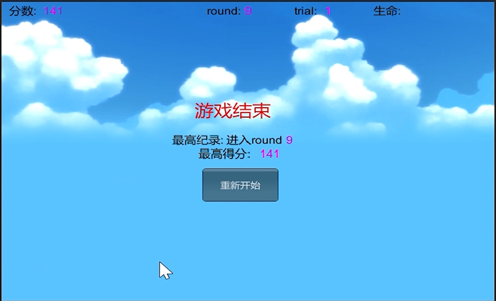

# 项目文档
## 项目要求
编写一个简单的鼠标打飞碟（Hit UFO）游戏
+ 游戏内容要求：
    + 游戏有 n 个 round，每个 round 都包括10 次 trial；
    + 每个 trial 的飞碟的色彩、大小、发射位置、速度、角度、同时出现的个数都可能不同。它们由该 round 的 ruler 控制；
    + 每个 trial 的飞碟有随机性，总体难度随 round 上升；
    + 鼠标点中得分，得分规则按色彩、大小、速度不同计算，规则可自由设定。
+ 基础版游戏的要求：
    + 使用带缓存的工厂模式管理不同飞碟的生产与回收，该工厂必须是场景单实例的！具体实现见参考资源 Singleton 模板类
    + 尽可能使用前面 MVC 结构实现人机交互与游戏模型分离
+ 适配器版游戏的要求：
    + 按 adapter模式 设计图修改飞碟游戏
    + 使它同时支持物理运动与运动学（变换）运动
## 项目配置
+ 新建项目，将Assets文件替换为我项目中的Assets文件，由于第五章、第六章作业合并，故基础版和运动与物理兼容版文件夹下各有一个Assets
+ 将Assets/Resources/Fantasy Skybox FREE/Materials/Classic中的第一个天空盒FS000_Day_01拖到Scene里
+ 将Assets/Resources/Scripts中的DiskFactory、RoundController、ScoreRecorder拖到Main Camera上
+ 编译运行，开始游戏
## 核心算法分析
### 基础版（仅使用射线，动作管理）
项目框架如下：


`DiskData.cs`规定了飞碟有如下属性：
```
    public int score = 1;                               //射击此飞碟得分
    public Color color = Color.white;                   //飞碟颜色
    public Vector3 direction;                           //飞碟初始的位置
    public Vector3 scale = new Vector3( 1 ,0.25f, 1);   //飞碟大小
```
`MyDiskEditor.cs`是用来制作预制的，实现飞碟属性图形化界面编辑：


具体代码如下：
```
using UnityEngine;
using UnityEditor;
using System.Collections;
[CustomEditor(typeof(DiskData))]
[CanEditMultipleObjects]
public class MyDEditor : Editor
{
    SerializedProperty score;                              //分数
    SerializedProperty color;                              //颜色
    SerializedProperty scale;                              //大小

    void OnEnable()
    {
        //序列化对象后获得各个值
        score = serializedObject.FindProperty("score");
        color = serializedObject.FindProperty("color");
        scale = serializedObject.FindProperty("scale");
    }

    public override void OnInspectorGUI()
    {
        //开启更新
        serializedObject.Update();
        //设置滑动条
        EditorGUILayout.IntSlider(score, 0, 5, new GUIContent("score"));
  
        if (!score.hasMultipleDifferentValues)
        {
            //显示进度条
            ProgressBar(score.intValue / 5f, "score");
        }
        //显示值
        EditorGUILayout.PropertyField(color);
        EditorGUILayout.PropertyField(scale);
        //应用更新
        serializedObject.ApplyModifiedProperties();
    }
    private void ProgressBar(float value, string label)
    {
        Rect rect = GUILayoutUtility.GetRect(18, 18, "TextField");
        EditorGUI.ProgressBar(rect, value, label);
        //中间留一个空行
        EditorGUILayout.Space();
    }
}
```
`RoundController.cs`是MVC结构里的控制器，是场景控制器，有以下几个成员变量
```
    public FlyActionManager action_manager;
    public DiskFactory disk_factory;
    public UserGUI user_gui;
    public ScoreRecorder score_recorder;

    private Queue<GameObject> disk_queue = new Queue<GameObject>();          //游戏场景中的飞碟队列
    private List<GameObject> disk_notshot = new List<GameObject>();          //没有被打中的飞碟队列
    private int round = 1;                                                   //回合
    private int trial = 1;
    private float interval = 2.1f;                                                //发射一个飞碟的时间间隔
    private bool playing_game = false;                                       //游戏中
    private bool game_over = false;                                          //游戏结束
    private bool game_start = false;                                         //游戏开始
```
实现了以下几个方法
```
//初始化
void Start ();
//每帧更新，定时调用LoadResources函数通知飞碟加工厂生产飞碟，调用发射飞碟函数
void Update ();
//更新trial和round和生成飞碟间隔
public void UpdateTrial();
//通知飞碟加工厂生产飞碟并加入飞碟队列
public void LoadResources();
//发射飞碟
private void SendDisk();
//处理点击事件
public void Hit(Vector3 pos);
//获得分数
public int GetScore();
//获得round
public int GetRound();
//获得trial
public int GetTrail();
//重新开始
public void ReStart();
//设定游戏结束
public void GameOver();
//暂停几秒后回收飞碟
IEnumerator WaitingParticle(float wait_time, RaycastHit hit, DiskFactory disk_factory, GameObject obj);
//开始游戏
public void BeginGame();
```
一些关键函数实现如下
```
//每帧更新，定时调用LoadResources函数通知飞碟加工厂生产飞碟，调用发送飞碟函数
void Update ()
{
    if(game_start)
    {
        //游戏结束，取消定时发送飞碟
        if (game_over)
        {
            CancelInvoke("LoadResources");//取消调用LoadResources
        }
        //设定一个定时器，发送飞碟，游戏开始
        if (!playing_game)
        {
            InvokeRepeating("LoadResources", 1f, interval);//1秒后调用LoadResources，每speed秒调用一次
            playing_game = true;
        }
        //发射飞碟
        SendDisk();
    }
}
//发射飞碟
private void SendDisk()
{
    float position_x = 9;                       
    if (disk_queue.Count != 0)
    {
        GameObject disk = disk_queue.Dequeue();
        disk_notshot.Add(disk);
        disk.SetActive(true);
        //设置被隐藏了或是新建的飞碟的位置
        float ran_y = Random.Range(3f, 6f);
        float ran_x = Random.Range(-1f, 1f) < 0 ? -1 : 1;
        disk.GetComponent<DiskData>().direction = new Vector3(ran_x, ran_y, 0);
        Vector3 position = new Vector3(-disk.GetComponent<DiskData>().direction.x * position_x, ran_y, 0);
        disk.transform.position = position;
        //设置飞碟初始所受的力和角度，飞碟速度总体随round增大而加快。
        float power = Random.Range(0.9f + 0.1f * round, 1.35f + 0.15f * round);
        float angle = Random.Range(15f, 28f);
        action_manager.UFOFly(disk,angle,power,round);
    }

    for (int i = 0; i < disk_notshot.Count; i++)
    {
        GameObject temp = disk_notshot[i];
        //飞碟飞出摄像机视野也没被打中
        if (temp.transform.position.y < -3 && temp.gameObject.activeSelf == true)
        {
            if(user_gui.life>1)UpdateTrial();
            disk_factory.FreeDisk(disk_notshot[i]);
            disk_notshot.Remove(disk_notshot[i]);
            //玩家血量-1
            user_gui.ReduceBlood();
        }
    }
}
public void Hit(Vector3 pos)
{
    Ray ray = Camera.main.ScreenPointToRay(pos);
    RaycastHit[] hits;
    hits = Physics.RaycastAll(ray);
    bool not_hit = false;
    for (int i = 0; i < hits.Length; i++)
    {
        RaycastHit hit = hits[i];
        //射线打中物体
        if (hit.collider.gameObject.GetComponent<DiskData>() != null)
        {
            //射中的物体要在没有打中的飞碟列表中
            for (int j = 0; j < disk_notshot.Count; j++)
            {
                if (hit.collider.gameObject.GetInstanceID() == disk_notshot[j].gameObject.GetInstanceID())
                {
                    not_hit = true;
                }
            }
            if(!not_hit)
            {
                return;
            }
            UpdateTrial();
            disk_notshot.Remove(hit.collider.gameObject);
            //记分员记录分数
            score_recorder.Record(hit.collider.gameObject);
            //显示爆炸粒子效果
            Transform explode = hit.collider.gameObject.transform.GetChild(0);
            explode.GetComponent<ParticleSystem>().Play();
            //等0.1秒后执行回收飞碟
            StartCoroutine(WaitingParticle(0.08f, hit, disk_factory, hit.collider.gameObject));
            break;
        }
    }
}
//暂停几秒后回收飞碟
IEnumerator WaitingParticle(float wait_time, RaycastHit hit, DiskFactory disk_factory, GameObject obj)
{
    yield return new WaitForSeconds(wait_time);
    //等待之后执行的动作  
    hit.collider.gameObject.transform.position = new Vector3(0, -9, 0);
    disk_factory.FreeDisk(obj);
}
```
`DiskFactory.cs`是飞碟工厂，实现了生产飞碟和回收飞碟两个方法，具体实现如下：
```
public class DiskFactory : MonoBehaviour
{
    public GameObject disk_prefab = null;                 //飞碟预制体
    private List<DiskData> used = new List<DiskData>();   //正在被使用的飞碟列表
    private List<DiskData> free = new List<DiskData>();   //空闲的飞碟列表

    public GameObject GetDisk(int round)
    {
        int choice = 0;
        int scope1 = 1, scope2 = 4, scope3 = 7;           //随机的范围
        float start_y = -10f;                             //刚实例化时的飞碟的竖直位置
        string tag;
        disk_prefab = null;

        //随机选择要飞出的飞碟
        choice = Random.Range(0, scope3);
        //将要选择的飞碟的tag
        if(choice <= scope1)
        {
            tag = "disk1";
        }
        else if(choice <= scope2 && choice > scope1)
        {
            tag = "disk2";
        }
        else
        {
            tag = "disk3";
        }
        //寻找相同tag的空闲飞碟
        for(int i=0;i<free.Count;i++)
        {
            if(free[i].tag == tag)
            {
                disk_prefab = free[i].gameObject;
                free.Remove(free[i]);
                break;
            }
        } 
        //如果空闲列表中没有，则重新实例化飞碟
        if(disk_prefab == null)
        {
            if (tag == "disk1")
            {
                disk_prefab = Instantiate(Resources.Load<GameObject>("Prefabs/disk1"), new Vector3(0, start_y, 0), Quaternion.identity);
            }
            else if (tag == "disk2")
            {
                disk_prefab = Instantiate(Resources.Load<GameObject>("Prefabs/disk2"), new Vector3(0, start_y, 0), Quaternion.identity);
            }
            else
            {
                disk_prefab = Instantiate(Resources.Load<GameObject>("Prefabs/disk3"), new Vector3(0, start_y, 0), Quaternion.identity);
            }
            //给新实例化的飞碟赋予其他属性
            float ran_x = Random.Range(-1f, 1f) < 0 ? -1 : 1;
            disk_prefab.GetComponent<Renderer>().material.color = disk_prefab.GetComponent<DiskData>().color;
            disk_prefab.GetComponent<DiskData>().direction = new Vector3(ran_x, start_y, 0);
            disk_prefab.transform.localScale = disk_prefab.GetComponent<DiskData>().scale;
        }
        //添加到使用列表中
        used.Add(disk_prefab.GetComponent<DiskData>());
        return disk_prefab;
    }

    //回收飞碟
    public void FreeDisk(GameObject disk)
    {
        for(int i = 0;i < used.Count; i++)
        {
            if (disk.GetInstanceID() == used[i].gameObject.GetInstanceID())
            {
                used[i].gameObject.SetActive(false);
                free.Add(used[i]);
                used.Remove(used[i]);
                break;
            }
        }
    }
}
```
`ScoreRecorder.cs`是记分员，负责记录分数和重置分数，具体实现如下：
```
public class ScoreRecorder : MonoBehaviour
{
    public int score;                   //分数
    void Start ()
    {
        score = 0;
    }
    //记录分数
    public void Record(GameObject disk)
    {
        int temp = disk.GetComponent<DiskData>().score;
        score = temp + score;
    }
    //重置分数
    public void Reset()
    {
        score = 0;
    }
}
```
`Singleton.cs`在`RoundController.cs`中被使用，确保飞碟工厂和记分员是单例模式，具体实现如下：
```
public class Singleton<T> : MonoBehaviour where T : MonoBehaviour
{
    protected static T instance;
    public static T Instance
    {
        get
        {
            if (instance == null)
            {
                instance = (T)FindObjectOfType(typeof(T));
                if (instance == null)
                {
                    Debug.LogError("An instance of " + typeof(T)
                        + " is needed in the scene, but there is none.");
                }
            }
            return instance;
        }
    }
}
```
``
`FlyActionManager.cs`是飞碟飞行的动作管理器，利用辅助类`UFOFlyAction.cs`计算飞碟飞行轨迹，控制飞碟飞行，具体实现如下：
```
public class FlyActionManager : SSActionManager
{

    public UFOFlyAction fly;                            //飞碟飞行的动作
    public RoundController scene_controller;             //当前场景的场景控制器

    protected void Start()
    {
        scene_controller = (RoundController)SSDirector.GetInstance().CurrentScenceController;
        scene_controller.action_manager = this;     
    }
    //飞碟飞行
    public void UFOFly(GameObject disk, float angle, float power, int round)
    {
        fly = UFOFlyAction.GetSSAction(disk.GetComponent<DiskData>().direction, angle, power);
        fly.gravity = -0.04f - 0.01f * round;
        this.RunAction(disk, fly, this);
    }
}

public class UFOFlyAction : SSAction
{
    public float gravity =(float) -0.05;                                 //向下的加速度
    private Vector3 start_vector;                              //初速度向量
    private Vector3 gravity_vector = Vector3.zero;             //加速度的向量，初始时为0
    private float time;                                        //已经过去的时间
    private Vector3 current_angle = Vector3.zero;               //当前时间的欧拉角

    private UFOFlyAction() { }
    public static UFOFlyAction GetSSAction(Vector3 direction, float angle, float power)
    {
        //初始化物体将要运动的初速度向量
        UFOFlyAction action = CreateInstance<UFOFlyAction>();
        if (direction.x < 0)
        {
            action.start_vector = Quaternion.Euler(new Vector3(0, 0, -angle)) * Vector3.left * power;
        }
        else
        {
            action.start_vector = Quaternion.Euler(new Vector3(0, 0, angle)) * Vector3.right * power;
        }
        return action;
    }

    public override void Update()
    {
        //计算物体的向下的速度,v=at
        time += Time.fixedDeltaTime;
        gravity_vector.y = gravity * time;

        //位移模拟
        transform.position += (start_vector + gravity_vector) * Time.fixedDeltaTime;
        current_angle.z = Mathf.Atan((start_vector.y + gravity_vector.y) / start_vector.x) * Mathf.Rad2Deg;
        transform.eulerAngles = current_angle;

        //如果物体y坐标小于-3，动作就做完了
        if (this.transform.position.y < -3)
        {
            this.destroy = true;
            this.callback.SSActionEvent(this);      
        }
    }

    public override void Start() { }
}
```
### 适配器版（运动与物理兼容）
项目框架如下：


为实现适配器模式，对基础版做了如下修改：
+ 增加的脚本：
    + `ActionManagerAdapter.cs`负责接收动作管理器通知，选择采用运动学还是物理运动接口控制飞碟飞行，具体实现如下：
        ```
        public class ActionManagerAdapter : MonoBehaviour,IActionManager
        {
            public FlyActionManager action_manager;
            public PhysisFlyActionManager phy_action_manager;
            public void playDisk(GameObject disk, float angle, float power,int round,bool isPhy)
            {
                if(isPhy)
                {
                    phy_action_manager.UFOFly(disk, angle, power,round);
                }
                else
                {
                    action_manager.UFOFly(disk, angle, power,round);
                }
            }
            // Use this for initialization
            void Start ()
            {
                action_manager = gameObject.AddComponent<FlyActionManager>() as FlyActionManager;
                phy_action_manager = gameObject.AddComponent<PhysisFlyActionManager>() as PhysisFlyActionManager;
            }

        }
        ```
    + `PhysisFlyActionManager.cs`使用物理运动控制飞碟飞行，具体实现如下：
        ```
        public class PhysisFlyActionManager : SSActionManager
        {

            public PhysisUFOFlyAction fly;                            //飞碟飞行的动作

            protected void Start()
            {
            }
            //飞碟飞行
            public void UFOFly(GameObject disk, float angle, float power,int round)
            {
                fly = PhysisUFOFlyAction.GetSSAction(disk.GetComponent<DiskData>().direction, angle, power);
                fly.round=round;
                this.RunAction(disk, fly, this);
            }
        }
        ```
    + `PhysisUFOFlyAction.cs`，使用运动物理计算飞碟飞行轨迹，由于重力加速度太大游戏飞碟坠落太快难度太高，需要给飞碟加一个持续的竖直向上的加速度，改变这个加速度可以使飞碟有一个随round增大而增大的向下的加速度，具体实现如下：
        ```
        public class PhysisUFOFlyAction : SSAction
        {
            private Vector3 start_vector;                              //初速度向量
            public float power;
            public int round;
            private PhysisUFOFlyAction() { }
            public static PhysisUFOFlyAction GetSSAction(Vector3 direction, float angle, float power)
            {
                //初始化物体将要运动的初速度向量
                PhysisUFOFlyAction action = CreateInstance<PhysisUFOFlyAction>();
                if (direction.x == -1)
                {
                    action.start_vector = Quaternion.Euler(new Vector3(0, 0, -angle)) * Vector3.left * power;
                }
                else
                {
                    action.start_vector = Quaternion.Euler(new Vector3(0, 0, angle)) * Vector3.right * power;
                }
                action.power = power;
                return action;
            }

            public override void FixedUpdate()
            {
                //判断是否超出范围
                if (this.transform.position.y < -3)
                {
                    this.destroy = true;
                    this.callback.SSActionEvent(this);
                }
            }
            public override void Update() { }
            public override void Start()
            {
                //使用重力加一个向上的加速度给飞碟一个随round增大而增大的向下的加速度
                gameobject.GetComponent<Rigidbody>().useGravity = true;
                gameobject.GetComponent<Rigidbody>().AddForce(new Vector3(0, 9.77f - 0.01f * round, 0),ForceMode.Acceleration);
                //给飞碟一个初速度
                gameobject.GetComponent<Rigidbody>().velocity = power * 7 * start_vector;
            }
        }
        ```
+ 修改的脚本：
    + `FlyActionManager.cs`去掉了对场景控制器的使用，修改后代码如下：
        ```
        public class FlyActionManager : SSActionManager
        {

            public UFOFlyAction fly;                            //飞碟飞行的动作

            protected void Start()
            {
            }
            //飞碟飞行
            public void UFOFly(GameObject disk, float angle, float power, int round)
            {
                fly = UFOFlyAction.GetSSAction(disk.GetComponent<DiskData>().direction, angle, power);
                fly.gravity = -0.04f - 0.01f * round;
                this.RunAction(disk, fly, this);
            }
        }
        ```
    + `Interface.cs`新增运动学与物理运动接口，具体实现如下：
        ```
        //运动学和物理运动接口
        public interface IActionManager
        {
            void playDisk(GameObject disk, float angle, float power,int round,bool isPhy);
        }
        ```
    + `RoundController.cs`增加新的成员变量isPhy并更改对动作管理器管理飞碟飞行方法的调用，注意要修改action_manager的类型为IActionManager，具体实现如下：
        ```
        public bool isPhy = true;                                               //是否使用物理运动

        //先将action_manager的类型修改为IActionManager，在修改实例化方法的调用
        action_manager = gameObject.AddComponent<ActionManagerAdapter>() as IActionManager;

        //动作管理器管理飞碟飞行方法调用
        action_manager.playDisk(disk, angle, power,round,isPhy);
        ```
    + `SSActionManager.cs`添加物理运动更新方法，具体实现如下
        ```
        protected void FixedUpdate()
        {
            foreach (SSAction ac in waitingAdd)
            {
                actions[ac.GetInstanceID()] = ac;
            }
            waitingAdd.Clear();

            foreach (KeyValuePair<int, SSAction> kv in actions)
            {
                SSAction ac = kv.Value;
                if (ac.destroy)
                {
                    waitingDelete.Add(ac.GetInstanceID());
                }
                else if (ac.enable)
                {
                    //物理运动更新
                    ac.FixedUpdate();
                }
            }
            foreach (int key in waitingDelete)
            {
                SSAction ac = actions[key];
                actions.Remove(key);
                DestroyObject(ac);
            }
            waitingDelete.Clear();
        }
        ```
    + `UFOFlyAction.cs`添加一个空的固定更新方法：
        ```
        public override void FixedUpdate() { }
        ```
## 效果展示
### 游戏规则
+ 游戏有无限多个round，每个round包括10次trial；
+ 鼠标点中飞碟得分，红色飞碟得3分，绿色飞碟得2分，紫色飞碟得1分，红飞碟体积最小，紫飞碟体积最大；
+ 每次trial得分不足该次trial出现飞碟总分数50%则生命-1，round结束后生命>0则进入下一个round，否则从round 1重新开始；
+ 每个trial的飞碟的色彩、大小、发射位置、速度、角度、同时出现的个数具有随机性，总体难度随round上升，即飞碟速度总体加快。
### 游戏截图
初始界面如下，展示了游戏规则：


游戏截图如下，界面上方展示了分数、round数、trial数、生命值：


击中飞碟有爆炸特效：


生命值耗光，游戏结束，显示最高记录回合数和最高分数：

