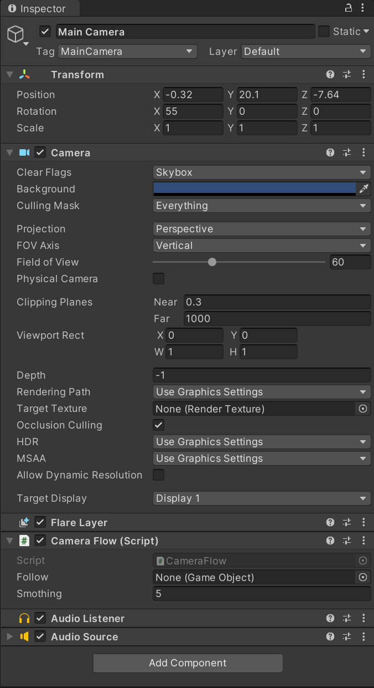
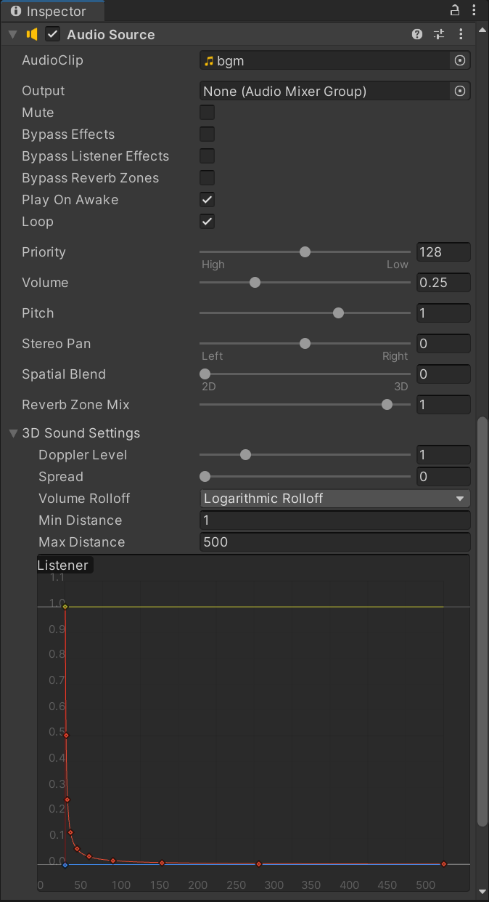
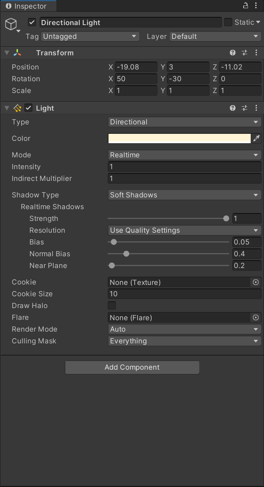
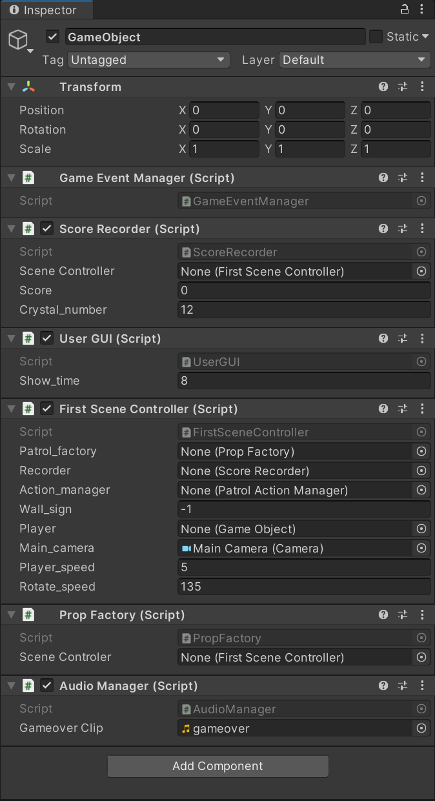

# 项目文档
## 项目要求
+ 游戏设计要求：
    + 创建一个地图和若干巡逻兵(使用动画)；
    + 每个巡逻兵走一个3~5个边的凸多边型，位置数据是相对地址。即每次确定下一个目标位置，用自己当前位置为原点计算；
    + 巡逻兵碰撞到障碍物，则会自动选下一个点为目标；
    + 巡逻兵在设定范围内感知到玩家，会自动追击玩家；
    + 失去玩家目标后，继续巡逻；
    + 计分：玩家每次甩掉一个巡逻兵计一分，与巡逻兵碰撞游戏结束；
+ 程序设计要求：
    + 必须使用订阅与发布模式传消息
        + subject：OnLostGoal
        + Publisher: ?
        + Subscriber: ?
    + 工厂模式生产巡逻兵
+ 友善提示1：生成 3~5个边的凸多边型
    + 随机生成矩形
    + 在矩形每个边上随机找点，可得到 3 - 4 的凸多边型
    + 5 ?
+ 友善提示2：参考以前博客，给出自己新玩法
## 项目配置
+ 新建项目，将Assets文件替换为我项目中的Assets文件，Assets/Scenes/中的myScene是本次游戏场景，直接拖入左栏Hierarchy再remove掉原来存在的Untitled即可运行游戏
+ Main Camera配置如下：

    

    
+ Directional Light配置如下：

    
+ 新建一个GameObject，配置如下：

    
## 核心算法分析

## 效果展示
### 游戏规则
+ 使用上下键前后移动，使用左右键转向
+ 玩家每次甩掉一个巡逻兵计一分，每收集一个水晶会随机触发效果
+ 得分水晶随机加1~5分，变速水晶会使玩家加速或减速
+ 玩家分数达到20则游戏胜利，与巡逻兵碰撞游戏结束
### 游戏截图
