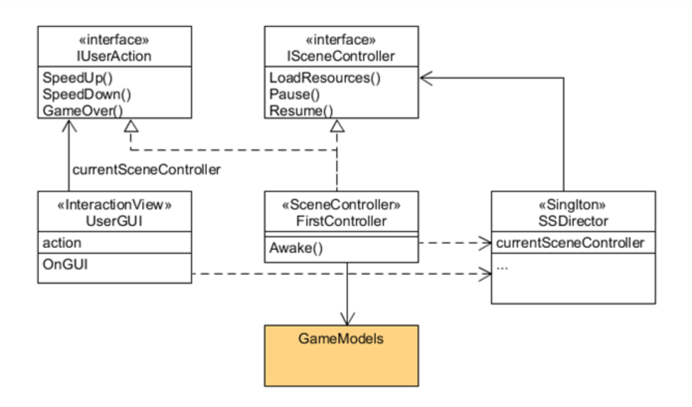
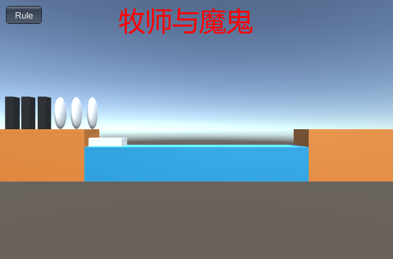
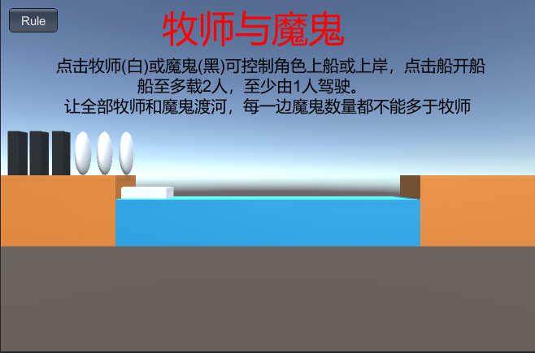
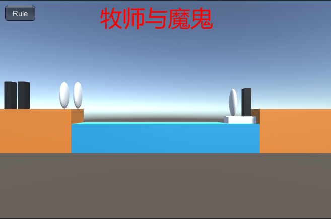
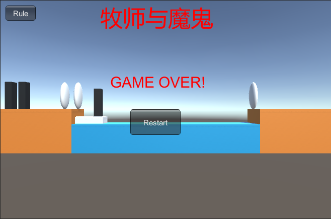
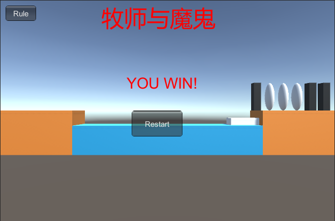

# 项目文档
## 项目配置
+ 首先新建项目
+ 将我的Asserts文件夹替换Unity项目中的Asserts文件夹
+ 把Assets/Resources/Scripts/Controllor.cs挂载到Main Camera上
+ 点击运行按钮开始游戏
## 项目实现
### 游戏中提及的事物
魔鬼、牧师、船、河、两边的陆地
### 用表格列出玩家的动作表
|  玩家动作   | 执行条件  |执行结果|  
|  ----  | ----  |---|
| 点击牧师/魔鬼  | 游戏进行中，船在岸边，该牧师/魔鬼与船在同一边的岸上/在船上 | 牧师/魔鬼上船/上岸
| 点击船  | 游戏进行中且船上有1或2个人 |船移动到另一边
### 实现思路
程序设计框架：



使用MVC架构，MVC是界面人机交互程序设计的一种架构模式，它把程序分为三个部分：
+ 模型（Model）：数据对象及关系
    + 游戏对象、空间关系
+ 控制器（Controller）：接受用户事件，控制模型的变化
    + 一个场景一个主控制器
    + 至少实现与玩家交互的接口（IPlayerAction）
    + 实现或管理运动
+ 界面（View）：显示模型，将人机交互事件交给控制器处理
    + 处理 Input 事件
    + 渲染 GUI ，接收事件

在本项目中：
+ 接口：ISceneController和IUserAction两个接口，分别定义场景操作和用户操作
+ 导演：SSDirector采用单例模式，把握全局，控制场景
+ Model：BoatModel、RoleModel、LandModel三个类
+ Controllor：Controllor类，接受用户事件，控制模型的变化
+ View：UserGUI类，与用户交互
+ 辅助脚本。Move和Click类，定义了移动的方式和对点击模型事件的处理
### 核心模块介绍
**Model**

`BoatModel`类有以下几个成员变量：
```
GameObject boat;                                          
Vector3[] from_empty_pos;                                    //船在起点陆地的空位位置
Vector3[] to_empty_pos;                                      //船在终点陆地的空位位置
Move move;                                                    
Click click;
int boat_state = 1;                                          //0：船在终点；1：船在起点
RoleModel[] roles = new RoleModel[2]; 
```
定义了以下几个方法：
```
//构造函数
public BoatModel();
//检测船是否为空
public bool IsEmpty();
//移动船
public void BoatMove();
//获得船的状态：在终点返回0、在起点返回1
public int GetBoatState();
//根据角色名移除船上的一个角色
public RoleModel DeleteRole(string role_name);
//搜索船上的空位下标
public int GetEmptyIndex();
//获得船上空位的坐标
public Vector3 GetEmptyPosition();
//在船上添加一个角色
public void AddRole(RoleModel role);
//获得船对象
public GameObject GetBoat();
//重置船对象
public void Reset();
//计算船上牧师和魔鬼的数量
public int[] GetRoleType();
```
其中比较重要的算法实现如下：
```
public BoatModel()
{
    boat = Object.Instantiate(Resources.Load("Prefabs/Boat", typeof(GameObject)), new Vector3(-5.5F, 0, 0), Quaternion.identity) as GameObject;
    boat.name = "boat";
    move = boat.AddComponent(typeof(Move)) as Move;
    click = boat.AddComponent(typeof(Click)) as Click;
    click.SetBoat(this);
    from_empty_pos = new Vector3[] { new Vector3(-6, 1.5F, 0), new Vector3(-5, 1.5F, 0) };
    to_empty_pos = new Vector3[] { new Vector3(5, 1.5F, 0), new Vector3(6, 1.5F, 0) };
}
public void BoatMove()
{
    if (boat_state == 0)
    {
        move.MoveTo(new Vector3(-5.5F, 0, 0));
        boat_state = 1;
    }
    else
    {
        move.MoveTo(new Vector3(5.5F, 0, 0));
        boat_state = 0;
    }
}
public RoleModel DeleteRole(string role_name)
{
    int i=-1;
    if (roles[0] != null && roles[0].GetName() == role_name)i=0;
    else if (roles[1] != null && roles[1].GetName() == role_name)i=1;
    if(i == 0||i == 1){
        RoleModel role = roles[i];
        roles[i] = null;
        return role;
    }
    return null;
}
```
`RoleModel`类有以下几个成员变量：
```
GameObject role;
int role_type;             //0为牧师，1为魔鬼     
Move move;
Click click;
bool on_boat;              //是否在船上  
LandModel land_model = (SSDirector.GetInstance().CurrentScenceController as Controllor).from_land;
```
定义了以下几个方法：
```
//构造函数
public RoleModel(string role_name);
//获得角色类型：0为牧师，1为魔鬼
public int GetType();
//获得陆地对象
public LandModel GetLandModel();
//获得角色名称
public string GetName();
//检测此角色是否在船上
public bool IsOnBoat();
//设置角色名称
public void SetName(string name);
//设置角色初始位置
public void SetPosition(Vector3 pos);
//上岸
public void GoLand(LandModel land);
//上船
public void GoBoat(BoatModel boat);
//重置角色，所有角色要回到起点陆地
public void Reset();
```
其中比较重要的算法实现如下：
```
public RoleModel(string role_name)
{
    if (role_name == "priest")
    {
        role = Object.Instantiate(Resources.Load("Prefabs/Priest", typeof(GameObject)), Vector3.zero, Quaternion.identity) as GameObject;
        role_type = 0;
    }
    else
    {
        role = Object.Instantiate(Resources.Load("Prefabs/Devil", typeof(GameObject)), Vector3.zero, Quaternion.identity) as GameObject;
        role_type = 1;
    }
    move = role.AddComponent(typeof(Move)) as Move;
    click = role.AddComponent(typeof(Click)) as Click;
    click.SetRole(this);
}
public void GoLand(LandModel land)
{  
    move.MoveTo(land.GetEmptyPosition());
    role.transform.parent = null;
    land_model = land;
    on_boat = false;
}
public void GoBoat(BoatModel boat)
{
    move.MoveTo(boat.GetEmptyPosition());
    role.transform.parent = boat.GetBoat().transform;
    land_model = null;          
    on_boat = true;
}
public void Reset()
{
    land_model = (SSDirector.GetInstance().CurrentScenceController as Controllor).from_land;
    GoLand(land_model);
    SetPosition(land_model.GetEmptyPosition());
    land_model.AddRole(this);
}
```
`LandModel`类有以下几个成员变量：
```
GameObject land;                                
Vector3[] positions;                            //保存每个角色放在陆地上的位置
int land_type;                                  //终点陆地标志为0，起点陆地标志为1
RoleModel[] roles = new RoleModel[6];           //陆地上有的角色
```
定义了以下几个方法：
```
//构造函数
public LandModel(string land_name);
//得到陆地上哪一个位置是空的
public int GetEmptyIndex();
//确定陆地类型：0-终点、1-起点
public int GetLandType();
//得到陆地上空位置
public Vector3 GetEmptyPosition();
//向陆地上添加角色
public void AddRole(RoleModel role);
//根据名称移除陆地上的角色
public RoleModel DeleteRole(string role_name);
//计算陆地上牧师和魔鬼的数量
public int[] GetRoleType();
//重置陆地，生成新的六个角色
public void Reset();
```
其中比较重要的算法实现如下：
```
public LandModel(string land_name)
{
    positions = new Vector3[] {new Vector3(-6.5F,2,0), new Vector3(-7.5F,2,0), new Vector3(-8.5F,2,0),new Vector3(-9.5F,2,0), new Vector3(-10.5F,2,0), new Vector3(-11.5F,2,0)};
    if (land_name == "from")
    {
        land = Object.Instantiate(Resources.Load("Prefabs/Land", typeof(GameObject)), new Vector3(11, -0.5F, 0), Quaternion.identity) as GameObject;
        land_type = 1;
    }
    else
    {
        land = Object.Instantiate(Resources.Load("Prefabs/Land", typeof(GameObject)), new Vector3(-11, -0.5F, 0), Quaternion.identity) as GameObject;
        land_type = 0;
    }
}
public Vector3 GetEmptyPosition()               
{
    Vector3 pos = positions[GetEmptyIndex()];
    if(land_type == 0)pos.x = -pos.x;                  //两个陆地是x坐标对称，起点为负，终点为正
    return pos;
}
```
**Controllor**

`Controllor`类有以下几个成员变量：
```
public LandModel from_land;            //左侧起点陆地
public LandModel to_land;              //右侧终点陆地
public BoatModel boat;                  //船
private RoleModel[] roles;              //角色
UserGUI user_gui;                       //GUI界面
```
定义了以下几个方法：
```
void Start ();
//创建水、陆地、牧师、魔鬼、船
public void LoadResources();
//在船上有人且游戏正在进行中的状态下移动船，并检查游戏是否结束
public void MoveBoat();
//移动角色，并检查游戏是否结束
public void MoveRole(RoleModel role);
//重置游戏
public void Restart();
//检查游戏状态：0-游戏继续、1-游戏失败、2-游戏获胜
public int Check();
```
其中比较重要的算法实现如下：
```
void Start ()
{
    SSDirector director = SSDirector.GetInstance();
    director.CurrentScenceController = this;
    user_gui = gameObject.AddComponent<UserGUI>() as UserGUI;
    transform.position = transform.rotation * (new Vector3(0, 1, -14));//设置Main Camera位置
    LoadResources();
}
public void LoadResources()              
{
    GameObject water = Instantiate(Resources.Load("Prefabs/Water", typeof(GameObject)), new Vector3(0, -1, 0), Quaternion.identity) as GameObject;
    water.name = "water";       
    from_land = new LandModel("from");
    to_land = new LandModel("to");
    boat = new BoatModel();
    roles = new RoleModel[6];

    //初始时角色全置于左侧起点陆地
    for (int i = 0; i < 6; i++)
    {
        RoleModel role;
        if(i<3){
            role = new RoleModel("priest");
            role.SetName("priest" + i);
        }
        else{
            role = new RoleModel("devil");
            role.SetName("devil" + (i-3));
        }
        role.SetPosition(from_land.GetEmptyPosition());
        role.GoLand(from_land);
        from_land.AddRole(role);
        roles[i] = role;
    }
}
public int Check()
{
    int from_priests = (from_land.GetRoleType())[0];
    int from_devils = (from_land.GetRoleType())[1];
    int to_priests = (to_land.GetRoleType())[0];
    int to_devils = (to_land.GetRoleType())[1];
    //全部角色均到达终点则获胜
    if (to_priests + to_devils == 6)
        return 2;
    //一侧魔鬼多于牧师则失败
    int[] boat_role_type = boat.GetRoleType();
    if (boat.GetBoatState() == 1)         //船在起点岸边
    {
        from_priests += boat_role_type[0];
        from_devils += boat_role_type[1];
    }
    else                             //船在终点岸边
    {
        to_priests += boat_role_type[0];
        to_devils += boat_role_type[1];
    }
    if ((from_priests > 0 && from_priests < from_devils)||(to_priests > 0 && to_priests < to_devils)) //失败
    {      
        return 1;
    }
    //游戏继续
    return 0;                                             
}
```
**View**

`UserGUI`类有以下几个成员变量：
```
private IUserAction action;
public int state = 0;//游戏状态：0-正在进行中；1-获胜；2-失败
bool ShowRule = false;//显示游戏规则
private GUIStyle title_style;
private GUIStyle result_style;
private GUIStyle rule_style;
private GUIStyle button_style;
```
定义了以下几个方法：
```
//初始化字体样式
void init();
void Start();
//记录用户点击Rule按钮事件
void rule();
//每帧刷新界面
void OnGUI();
```
其中比较重要的算法实现如下：
```
void Start()
{
    //获得控制器对象
    action = SSDirector.GetInstance().CurrentScenceController as IUserAction;
    init();
}
void OnGUI()
{
    GUI.Label(new Rect(Screen.width / 2 - 130, 10, 200, 50), "牧师与魔鬼", title_style);
    if (GUI.Button(new Rect(10, 10, 60, 30), "Rule", button_style)) rule();
    if(ShowRule)
    {
    GUI.Label(new Rect(Screen.width / 2 - 260, 70, 200, 20), "点击牧师(白)或魔鬼(黑)可控制角色上船或上岸，点击船开船", rule_style);
    GUI.Label(new Rect(Screen.width / 2 - 160, 95, 300, 20), "船至多载2人，至少由1人驾驶。", rule_style);
    GUI.Label(new Rect(Screen.width / 2 - 250, 120, 240, 20), "让全部牧师和魔鬼渡河，每一边魔鬼数量都不能多于牧师", rule_style);
    }
    if (state == 1)
    {
        GUI.Label(new Rect(Screen.width / 2-110, Screen.height / 2-70, 100, 50), "GAME OVER!", result_style);
        if (GUI.Button(new Rect(Screen.width / 2 - 70, Screen.height / 2, 100, 50), "Restart", button_style))
        {
            action.Restart();
            state = 0;
        }
    }
    else if (state == 2)
    {
        GUI.Label(new Rect(Screen.width / 2 - 80, Screen.height / 2 - 70, 100, 50), "YOU WIN!", result_style);
        if (GUI.Button(new Rect(Screen.width / 2 - 70, Screen.height / 2, 100, 50), "Restart", button_style))
        {
            action.Restart();
            state = 0;
        }
    }
}
```
## 效果展示
### 玩法说明
牧师和魔鬼是一款益智游戏，你将帮助牧师和魔鬼在限定时间内过河。河的一边有三个牧师和三个魔鬼。他们都想去这条河的对岸，但是只有一艘船，这艘船每次只能载两个人。必须有一个人把船从一边开到另一边。在flash游戏中，你可以点击它们移动它们，然后点击船将船移动到另一个方向。如果在河的两边，牧师的人数超过了魔鬼，他们就会被杀，游戏就结束了。你可以用很多方法来尝试。让所有牧师活着！祝你好运！
### 效果截图
启动游戏，初始界面如下图:



点击左上角Rule按钮可以查看游戏规则



游戏进行中效果图：点击最左侧的牧师和最右侧的魔鬼，然后点击船



游戏失败界面，点击Restart按钮可以重新开始游戏



游戏获胜界面，点击Restart按钮可以重新开始游戏

