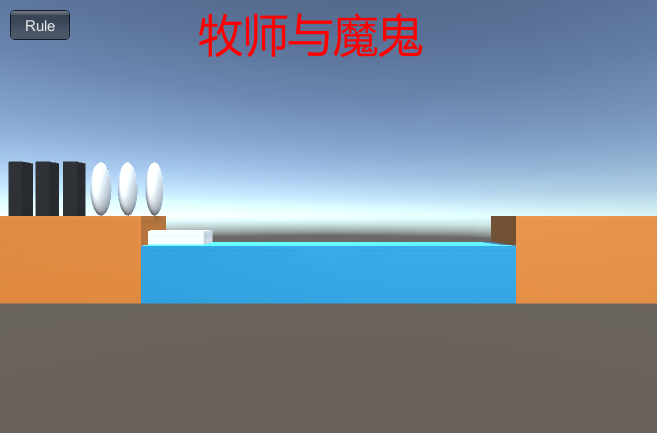
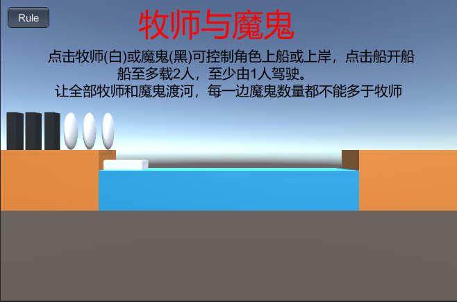
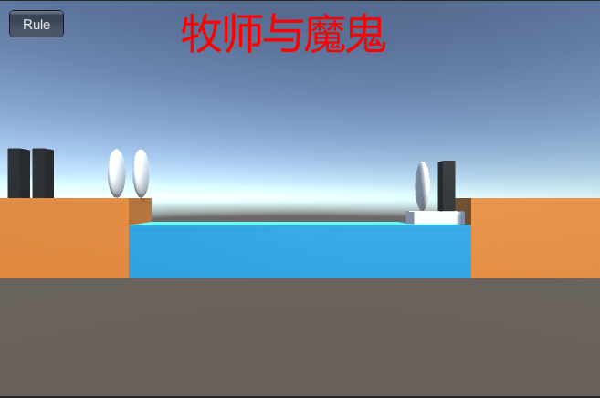
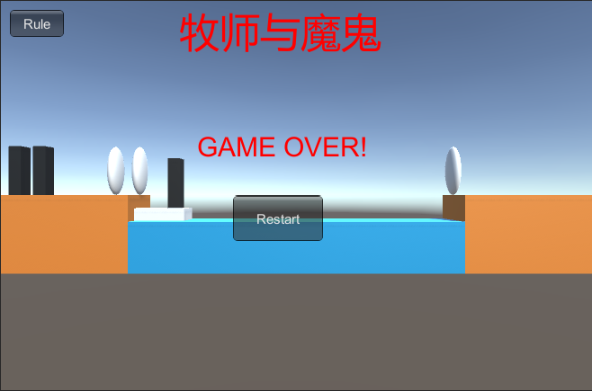
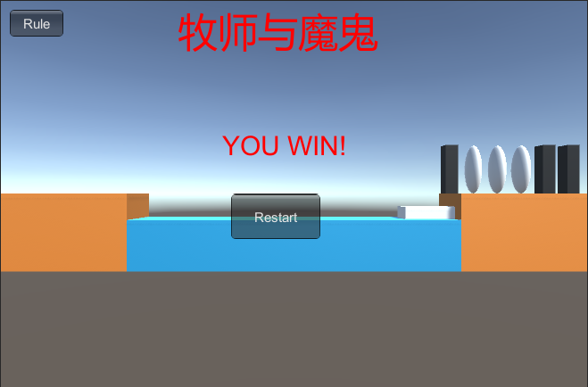

# 项目文档
## 项目配置
+ 首先新建项目
+ 将我的Asserts文件夹替换Unity项目中的Asserts文件夹
+ 把Assets/Resources/Scripts/Controllor.cs挂载到Main Camera上
+ 点击运行按钮开始游戏
## 项目实现
### 实现思路
+ 动作分离版的改进目的主要有以下两点：
    + 将角色的动作（上船、上岸）和船的动作（开往对岸）分离出来交给动作管理器管理
    + 增加裁判类，当游戏达到结束条件时，通知场景控制器游戏结束
+ 做出以下四点改进：
    + Actions.cs：新增脚本，编写动作管理器相关类，包括SSAction、CCMoveToAction、CCSequenceAction、ISSActionCallback、SSActionManager、CCActionManager
    + Controllor.cs：使用裁判对象判定游戏状态，通知动作管理器完成角色的动作（上船、上岸）和船的动作（开往对岸）
    + Model.cs：去掉Move辅助类，对BoatModel和RoleModel添加移速变量，对相关方法进行修改
    + Umpire.cs：新增脚本，编写裁判类判定游戏状态，当游戏达到结束条件时，通知场景控制器游戏结束
### 核心算法介绍
**Actions.cs**

+ 动作基类
    + 设计要点：
        + ScriptableObject 是不需要绑定 GameObject 对象的可编程基类。这些对象受 Unity 引擎场景管理
        + protected 防止用户自己 new 抽象的对象
        + 使用 virtual 申明虚方法，通过重写实现多态。这样继承者就明确使用 Start 和 Update 编程游戏对象行为
        + 利用接口（ISSACtionCallback）实现消息通知，避免与动作管理者直接依赖
    + 代码实现：
        ```
        public class SSAction : ScriptableObject            //动作
        {

            public bool enable = true;                      //是否正在进行此动作
            public bool destroy = false;                    //是否需要被销毁

            public GameObject gameobject{get;set;}          //动作对象
            public Transform transform{get;set;}            //动作对象的transform
            public ISSActionCallback callback{get;set;}     //回调函数

            protected SSAction() { }                        //保证SSAction不会被new

            public virtual void Start()                     //初始化
            {
                throw new System.NotImplementedException();
            }

            public virtual void Update()                   //每帧调用一次更新
            {
                throw new System.NotImplementedException();
            }
        }
        ```
+ 简单动作实现：实现具体动作，将一个物体移动到目标位置，并通知任务完成
    + 设计要点：
        + 让 Unity 创建动作类，确保内存正确回收。
        + 多态。C++ 语言必申明重写，Java则默认重写
        + 动作完成，并发出事件通知，期望管理程序自动回收运行对象。
    + 代码实现：
        ```
        public class CCMoveToAction : SSAction                        //移动
        {
            public Vector3 target;        //移动到的目的地
            public float speed;           //移动的速度

            public static CCMoveToAction GetSSAction(Vector3 target, float speed)
            {
                CCMoveToAction action = ScriptableObject.CreateInstance<CCMoveToAction>();//让unity自己创建一个CCMoveToAction实例，并自己回收
                action.target = target;
                action.speed = speed;
                return action;
            }

            public override void Update()
            {
                this.transform.position = Vector3.MoveTowards(this.transform.position, target, speed * Time.deltaTime);
                if (this.transform.position == target)
                {
                    this.destroy = true;
                    this.callback.SSActionEvent(this);      //告诉动作管理或动作组合这个动作已完成
                }
            }

            public override void Start()
            {
                //移动动作建立时候不做任何事情
            }
        }
        ```
+ 顺序动作组合类实现:实现一个动作组合序列，顺序播放动作
    + 设计要点：
        + 让动作组合继承抽象动作，能够被进一步组合；实现回调接受，能接收被组合动作的事件
        + 创建一个动作顺序执行序列，-1 表示无限循环，start 开始动作。
        + Update方法执行执行当前动作
        + SSActionEvent 收到当前动作执行完成，推下一个动作，如果完成一次循环，减次数。如完成，通知该动作的管理者
        + Start 执行动作前，为每个动作注入当前动作游戏对象，并将自己作为动作事件的接收者
        + OnDestory 如果自己被注销，应该释放自己管理的动作。
    + 代码实现：
        ```
        public class CCSequenceAction : SSAction, ISSActionCallback
        {
            public List<SSAction> sequence;    //动作的列表
            public int repeat = -1;            //-1就是无限循环做组合中的动作
            public int start = 0;              //当前做的动作的索引

            public static CCSequenceAction GetSSAcition(int repeat, int start, List<SSAction> sequence)
            {
                CCSequenceAction action = ScriptableObject.CreateInstance<CCSequenceAction>();//让unity自己创建一个CCSequenceAction实例
                action.repeat = repeat;
                action.sequence = sequence;
                action.start = start;
                return action;
            }

            public override void Update()
            {
                if (sequence.Count == 0) return;
                if (start < sequence.Count)
                {
                    sequence[start].Update();     //一个组合中的一个动作执行完后会调用接口,所以这里看似没有start++实则是在回调接口函数中实现
                }
            }

            public void SSActionEvent(SSAction source, SSActionEventType events = SSActionEventType.Competeted,
                int intParam = 0, string strParam = null, Object objectParam = null)
            {
                source.destroy = false;          //先保留这个动作，如果是无限循环动作组合之后还需要使用
                this.start++;
                if (this.start >= sequence.Count)
                {
                    this.start = 0;
                    if (repeat > 0) repeat--;
                    if (repeat == 0)
                    {
                        this.destroy = true;               //整个组合动作就删除
                        this.callback.SSActionEvent(this); //告诉组合动作的管理对象组合做完了
                    }
                }
            }

            public override void Start()
            {
                foreach (SSAction action in sequence)
                {
                    action.gameobject = this.gameobject;
                    action.transform = this.transform;
                    action.callback = this;                //组合动作的每个小的动作的回调是这个组合动作
                    action.Start();
                }
            }

            void OnDestroy()
            {
                //如果组合动作做完第一个动作突然不要它继续做了，那么后面的具体的动作需要被释放
            }
        }
        ```
+ 动作事件接口定义：接口作为接收通知对象的抽象类型
    + 设计要点：
        + 事件类型定义，使用了 枚举变量
        + 定义了事件处理接口，所有事件管理者都必须实现这个接口，来实现事件调度。所以，组合事件需要实现它，事件管理器也必须实现它。
        + 这里展示了语言函数默认参数的写法。
    + 代码实现：
        ```
        public enum SSActionEventType : int { Started, Competeted }

        public interface ISSActionCallback
        {
            void SSActionEvent(SSAction source, SSActionEventType events = SSActionEventType.Competeted,
                int intParam = 0, string strParam = null, Object objectParam = null);
        }
        ```
+ 动作管理基类:这是动作对象管理器的基类，实现了所有动作的基本管理
    + 设计要点：
        + 创建 MonoBehaiviour 管理一个动作集合，动作做完自动回收动作。
        + update 演示了由添加、删除等复杂集合对象的使用。
        + 提供了添加新动作的方法 RunAction。该方法把游戏对象与动作绑定，并绑定该动作事件的消息接收者。
        + 执行该动作的 Start 方法
    + 代码实现：
        ```
        public class SSActionManager : MonoBehaviour                      //action管理器
        {

            private Dictionary<int, SSAction> actions = new Dictionary<int, SSAction>();    //将执行的动作的字典集合,int为key，SSAction为value
            private List<SSAction> waitingAdd = new List<SSAction>();                       //等待去执行的动作列表
            private List<int> waitingDelete = new List<int>();                              //等待删除的动作的key                

            //每帧调用更新
            protected void Update()
            {
                foreach (SSAction ac in waitingAdd)
                {
                    actions[ac.GetInstanceID()] = ac;                                      //获取动作实例的ID作为key
                }
                waitingAdd.Clear();

                foreach (KeyValuePair<int, SSAction> kv in actions)
                {
                    SSAction ac = kv.Value;
                    if (ac.destroy)
                    {
                        waitingDelete.Add(ac.GetInstanceID());//释放动作
                    }
                    else if (ac.enable)
                    {
                        ac.Update();//更新动作
                    }
                }

                foreach (int key in waitingDelete)
                {
                    SSAction ac = actions[key];
                    actions.Remove(key);
                    DestroyObject(ac);
                }
                waitingDelete.Clear();
            }

            public void RunAction(GameObject gameobject, SSAction action, ISSActionCallback manager)
            {
                action.gameobject = gameobject;
                action.transform = gameobject.transform;
                action.callback = manager;
                waitingAdd.Add(action);
                action.Start();
            }

            //初始化
            protected void Start(){
            }
        }
        ```
+ 本游戏动作管理器：管理角色的动作（上船、上岸）和船的动作（开往对岸）
    ```
    public class CCActionManager : SSActionManager,ISSActionCallback  //本游戏管理器
    {

        private CCMoveToAction moveBoatToEndOrStart;     //移动船到结束岸，移动船到开始岸
        private CCSequenceAction moveRoleToLandorBoat;     //移动角色到陆地，移动角色到船上

        public Controllor sceneController;

        public void SSActionEvent(SSAction source, SSActionEventType events = SSActionEventType.Competeted,
            int intParam = 0, string strParam = null, Object objectParam = null)
        {
            //牧师与魔鬼的游戏对象移动完成后就没有下一个要做的动作了，所以回调函数为空
        }
        protected new void Start()
        {
            sceneController = (Controllor)SSDirector.GetInstance().CurrentScenceController;
            sceneController.actionManager = this;
        }
        public void moveBoat(GameObject boat, Vector3 target, float speed)
        {
            moveBoatToEndOrStart = CCMoveToAction.GetSSAction(target, speed);
            this.RunAction(boat, moveBoatToEndOrStart, this);
        }

        public void moveRole(GameObject role, Vector3 middle_pos, Vector3 end_pos, float speed)
        {
            SSAction action1 = CCMoveToAction.GetSSAction(middle_pos, speed);
            SSAction action2 = CCMoveToAction.GetSSAction(end_pos, speed);
            moveRoleToLandorBoat = CCSequenceAction.GetSSAcition(1, 0, new List<SSAction> { action1, action2 });
            this.RunAction(role, moveRoleToLandorBoat, this);
        }
    }
    ```
**Controllor.cs**

+ 增加两个成员变量：
    ```
    Umpire umpire;                          //裁判
    public CCActionManager actionManager;          //动作管理器
    ```
+ Start函数中增加对裁判对象和动作管理器的初始化
    ```
    void Start ()
    {
        SSDirector director = SSDirector.GetInstance();
        director.CurrentScenceController = this;
        user_gui = gameObject.AddComponent<UserGUI>() as UserGUI;
        transform.position = transform.rotation * (new Vector3(0, 1, -14));//设置Main Camera位置
        LoadResources();
        umpire=new Umpire(from_land,to_land,boat);
        actionManager = gameObject.AddComponent<CCActionManager>() as CCActionManager;  
    }
    ```
+ 修改MoveBoat函数，通知动作管理器完成船的移动
    ```
    //在船上有人且游戏正在进行中的状态下移动船，并检查游戏是否结束
    public void MoveBoat()                  
    {
        if (boat.IsEmpty() || user_gui.state != 0) return;
        //通知动作管理器执行开船动作
        actionManager.moveBoat(boat.getGameObject(),boat.BoatMoveToPosition(),boat.move_speed);

        user_gui.state = Check();
    }
    ```
+ 修改MoveRole函数，通知动作管理器完成角色的移动
    ```
    //移动角色，并检查游戏是否结束
    public void MoveRole(RoleModel role)    
    {
        if (user_gui.state != 0) return;
        if (role.IsOnBoat())//如果在船上就上岸
        {
            LandModel land;
            if (boat.GetBoatState() == 0)
                land = to_land;
            else
                land = from_land;
            boat.DeleteRole(role.GetName());
            //通知动作管理器执行角色上岸动作，先竖直移动，后水平移动
            Vector3 end_pos = land.GetEmptyPosition();                                       
            Vector3 middle_pos = new Vector3(role.getGameObject().transform.position.x, end_pos.y, end_pos.z);
            actionManager.moveRole(role.getGameObject(), middle_pos, end_pos, role.move_speed); 

            role.GoLand(land);
            land.AddRole(role);
        }
        else//如果不在船上就上船
        {                                
            LandModel land = role.GetLandModel();
            if (boat.GetEmptyIndex() == -1 || land.GetLandType() != boat.GetBoatState()) return;   //船没有空位或此角色不在船停靠的那侧陆地，就不上船

            land.DeleteRole(role.GetName());
            //通知动作管理器执行角色上船动作，先水平移动，后竖直移动
            Vector3 end_pos = boat.GetEmptyPosition();                                             
            Vector3 middle_pos = new Vector3(end_pos.x, role.getGameObject().transform.position.y, end_pos.z); 
            actionManager.moveRole(role.getGameObject(), middle_pos, end_pos, role.move_speed);  

            role.GoBoat(boat);
            boat.AddRole(role);
        }
        user_gui.state = Check();
    }
    ```
+ 修改Check函数，使用裁判对象判定游戏状态
    ```
    public int Check()
    {
        return umpire.Check();
    }
    ```
**Model.cs**

删除了辅助类Move，对BoatModel类和RoleModel类做出修改

+ BoatModel类：
    + 去掉Move类相关引用
    + 增加成员变量：
        ```
        public float move_speed = 250;
        ```
    + 增加方法：
        ```
        public GameObject getGameObject() { return boat; }
        ```
    + 将BoatMove函数修改为BoatMoveToPosition函数，返回新位置而不是调用Move类方法移动
        ```
        public Vector3 BoatMoveToPosition()
        {
            if (boat_state == 0)
            {
                boat_state = 1;
                return new Vector3(-5.5F, 0, 0);
            }
            else
            {
                boat_state = 0;
                return new Vector3(5.5F, 0, 0);
            }
        }
        ```
+ RoleModel类：
    + 去掉Move类相关引用
    + 增加成员变量：
        ```
        public float move_speed = 250;
        ```
    + 增加方法：
        ```
        public GameObject getGameObject() { return role; }
        ```
**Umpire.cs**

+ 有三个成员变量：
    ```
    public LandModel from_land;            //左侧起点陆地
    public LandModel to_land;              //右侧终点陆地
    public BoatModel boat;                  //船
    ```
+ 在构造函数完成对成员变量的初始化
    ```
    public Umpire(LandModel FromLand,LandModel ToLand,BoatModel Boat)
    {
        from_land=FromLand;
        to_land=ToLand;
        boat=Boat;
    }
    ```
+ 游戏状态判定方法：
    ```
    public int Check()
    {
        int from_priests = (from_land.GetRoleType())[0];
        int from_devils = (from_land.GetRoleType())[1];
        int to_priests = (to_land.GetRoleType())[0];
        int to_devils = (to_land.GetRoleType())[1];
        //全部角色均到达终点则获胜
        if (to_priests + to_devils == 6)
            return 2;
        //一侧魔鬼多于牧师则失败
        int[] boat_role_type = boat.GetRoleType();
        if (boat.GetBoatState() == 1)         //船在起点岸边
        {
            from_priests += boat_role_type[0];
            from_devils += boat_role_type[1];
        }
        else                             //船在终点岸边
        {
            to_priests += boat_role_type[0];
            to_devils += boat_role_type[1];
        }
        if ((from_priests > 0 && from_priests < from_devils)||(to_priests > 0 && to_priests < to_devils)) //失败
        {      
            return 1;
        }
        //游戏继续
        return 0;                                             
    }
    ```
**UserGUI.cs**

未做修改，与上一版本牧师与魔鬼相同，不再赘述。
## 效果展示
### 玩法说明
牧师和魔鬼是一款益智游戏，你将帮助牧师和魔鬼在限定时间内过河。河的一边有三个牧师和三个魔鬼。他们都想去这条河的对岸，但是只有一艘船，这艘船每次只能载两个人。必须有一个人把船从一边开到另一边。在flash游戏中，你可以点击它们移动它们，然后点击船将船移动到另一个方向。如果在河的两边，牧师的人数超过了魔鬼，他们就会被杀，游戏就结束了。你可以用很多方法来尝试。让所有牧师活着！祝你好运！
### 效果截图
启动游戏，初始界面如下图:



点击左上角Rule按钮可以查看游戏规则



游戏进行中效果图：点击最左侧的牧师和最右侧的魔鬼，然后点击船



游戏失败界面，点击Restart按钮可以重新开始游戏



游戏获胜界面，点击Restart按钮可以重新开始游戏

