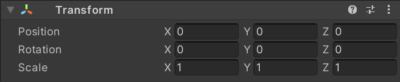
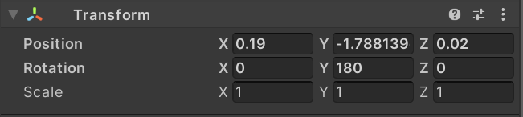
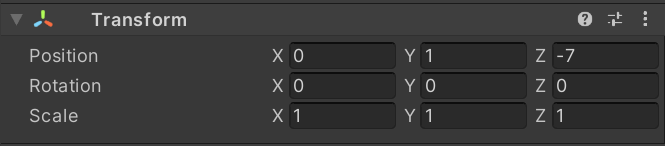
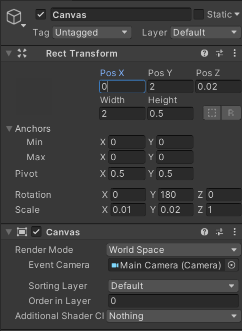
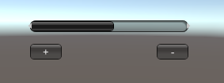
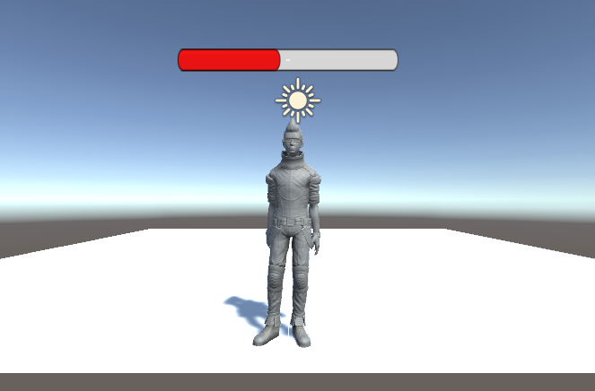

# 项目文档
## 项目要求
+ 血条（Health Bar）的预制设计。具体要求如下
    + 分别使用 IMGUI 和 UGUI 实现
    + 使用 UGUI，血条是游戏对象的一个子元素，任何时候需要面对主摄像机
    + 分析两种实现的优缺点
    + 给出预制的使用方法
## 项目配置
新建项目，将Assets文件替换为我项目中的Assets文件,Assets/Scenes/UGUIScenes和Assets/Scenes/IMGUIScenes，分别是两种方式实现的场景，拖入Hierarchy即可用
## IMGUI实现血条
+ 菜单 GameObject -> Create Empty，在游戏场景中创建一个空对象，修改名称为bloodBar_IMGUI
+ 将如下脚本拖到bloodBar_IMGUI上，使用HorizontalScrollbar来完成血条预制的制作，通过修改它的size属性值来表示血量的多少，在OnGUI函数中，先是判断点击的是加血量还是减血量按钮，再将血量数值加1或减1，为了使血量的变化过程连贯流畅，用Math.Lerp插值计算血量值，以此避免血量突变：
    ```
    using System.Collections;
    using System.Collections.Generic;
    using UnityEngine;
    
    public class IMGUIbloodBar : MonoBehaviour {
        public float curBlood = 5f;
        private float targetBlood = 5f;
        private Rect bloodBarArea;
        private Rect addButton;
        private Rect subButton;
        private int status = 0;//1:add -1:sub 0:不变
    
        void Start () {
            bloodBarArea = new Rect(Screen.width/2 - 80, Screen.height/2, 200, 50);
            addButton = new Rect(Screen.width/2 - 80,Screen.height/2 + 30, 40, 20);
            subButton = new Rect(Screen.width/2 + 80,Screen.height/2 + 30, 40, 20);
        }
    
        public void addBlood() {
            targetBlood = targetBlood + 1 > 10f? 10f : targetBlood + 1;
        }
    
        public void subBlood() {
            targetBlood = targetBlood - 1 < 0f? 0f : targetBlood - 1;
        }
    
        private void OnGUI() {
            if (GUI.Button(addButton, " + ")) status = 1;
            if (GUI.Button(subButton, " - ")) status = -1;
            if (status==1) {
                addBlood();
                status = 0;
            }
            else if (status==-1){
                subBlood();
                status = 0;
            }
            curBlood = Mathf.Lerp(curBlood, targetBlood, 0.1f);
            GUI.HorizontalScrollbar(bloodBarArea, 0f, curBlood, 0f, 10f);
        }
    }
    ```
## UGUI实现血条
### 资源导入
+ 菜单 GameObject -> 3D Object -> Plane，在游戏场景中创建一个plane，修改属性如下：

    
+ 父对象人物预制使用的是Assets/Standard Assets/Charactors/ThirdPersonCharater/Prefabs/ThirdPersonController，为寻找方便，将其复制到Assets/Prefabs并重命名为Person。将人物预制(Assets/Prefabs/Person)拖入场景,将名称改为bloodBar_UGUI，修改属性如下：

    
+ 修改Main Camera属性如下：

    
### 添加血条
+ 选择 bloodBar_UGUI 用上下文菜单（鼠标右键） -> UI -> Canvas，添加画布子对象
+ 选择 bloodBar_UGUI 的 Canvas，用上下文菜单 -> UI -> Slider，添加滑条作为血条子对象
+ 选择 bloodBar_UGUI 的 Canvas，在 Inspector 视图做如下设置：
    
+ 展开 Slider
    + 选择 Handle Slider Area，禁灰（disable）该元素
    + 选择 Fill Area 的 Fill，修改 Image 组件的 Color 为 红色
+ 选择Slider，在 Inspector 视图
    + 设置Slider 组件的 MaxValue 为 1
    + 设置Slider 组件的 Navigation 为 None
+ 给 Canvas 添加以下脚本 LookAtCamera.cs，使血条任何时候面朝一个方向，从而达到面对摄像头的目的
    ```
    using UnityEngine;

    public class LookAtCamera : MonoBehaviour {

        void Update () {
            this.transform.rotation = Quaternion.LookRotation(new Vector3(0, 0, 1));
        }
    }
    ```
## 效果展示
IMGUI实现血条



UGUI实现血条


## 两种实现的优缺点
+ IMGUI
    + 优点：
        + IMGUI的存在符合游戏编程的传统，即使在今天它依然没有被官方宣判为遗留（将要淘汰的）系统（Legacy Systems）
        + 在修改模型，渲染模型这样的经典游戏循环编程模式中，在渲染阶段之后，绘制 UI 界面无可挑剔
        + 这样的编程即避免了 UI 元素保持在屏幕最前端，又有最佳的执行效率，一切控制掌握在程序员手中
    + 缺点：
        + IMGUI系统通常不用于玩家可能使用并与之交互的普通游戏内用户界面，因其通过代码动态生成元素，每次调试都需要启动游戏观察，难以调试。
        + 传统代码驱动的 UI 面临效率低下
+ UGUI
    + 优点：
        + 所见即所得（WYSIWYG）设计工具，设计师也能参与程序开发
        + 支持多模式、多摄像机渲染
        + UI 元素与游戏场景融为一体的交互
        + 面向对象的编程
    + 缺点
        + 效率略低于IMGUI
        + 不符合游戏编程的传统
## 预制的使用方法
+ IMGUI完成的血条预制为bloodBar_IMGUI，拖放至场景中即可使用，可自由加减一定数量的血量。
+ UGUI完成的血条预制为bloodBar_UGUI，以人物预制(Assets/Prefabs/Person)作为父对象，拖放至场景中即可使用，用方向键控制人物移动，点击血条可修改血量。使用步骤如下：
    + 菜单 GameObject -> 3D Object -> Plane，在游戏场景中创建一个plane，修改属性如下：

        
    + 将血条预制bloodBar_UGUI拖入场景,修改属性如下：

        
    + 修改Main Camera属性如下：

        